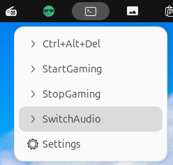
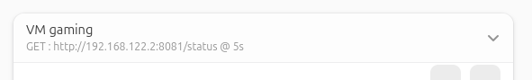

# homelab-gaming

Ce guide permet de transformer un PC Linux en station de jeu hybride TV / PC avec passthrough GPU.

## 🧩 Introduction

Ce dépôt documente:

- Un **PC hébergeant une machine virtuelle (VM)** avec **GPU passthrough** est utilisé comme station de jeu.
- La VM est **connectée à une TV** pour du gaming familial avec des manettes sans fil.
- La même VM peut également être utilisée depuis le **bureau du PC** si besoin pour jouer.
- Le PC peut toujours être utilisé comme un ordinateur classique.

## 🖥️ Hôte

| Composant      | Détails                     |
|----------------|-----------------------------|
| CPU            | AMD Ryzen 9 9900X           |
| GPU            | AMD Radeon™ RX 7800 XT      |
| Affichage      | Sortie HDMI vers TV + écran |
| Manette        | Xbox                        |

## 🖥️ Système

| Composant      | Détails                     |
|----------------|-----------------------------|
| OS             | Ubuntu 25.10                |
| Hyperviseur    | QEMU + libvirt              |
| OS VM          | Windows 10                  |

## Partie 1 - Configuration de l’hôte (Ubuntu)

### Isoler la carte graphique et l’USB

Exécution le script GPU passthrough pour isoler la carte graphique

```bash
cd gpu_passthrough/
sudo ./config.sh
```

Redémarrer la machine et exécuter une seconde fois pour vérifier l'isolation

```bash
cd gpu_passthrough/
sudo ./check.sh
```

### Créer la VM

Import de la VM

```bash
cd vm_qemu
./import_vm.sh
```

### Reconfigurer le réseau pour une IP fixe

```bash
$ virsh net-edit default
```

```xml
<network>
  <name>default</name>
  <uuid>927dcee2-c122-4c1d-9a60-0e331e7910c2</uuid>
  <forward mode='nat'/>
  <bridge name='virbr0' stp='on' delay='0'/>
  <mac address='52:54:00:23:ab:8b'/>
  <ip address='192.168.122.1' netmask='255.255.255.0'>
    <dhcp>
      <range start='192.168.122.2' end='192.168.122.2'/>
    </dhcp>
  </ip>
</network>
```

### Install Looking Glass Client

cd looking_glass
./install.sh

L'application est disponible via l'icone


### Déployer le script de gestion GPU vm-gpu.py

Le script `vm-gpu.py` est un workaround pour éviter des freezes à l'arrêt de la VM avec la carte graphique.

A déployer dans /home/user/console. Le script permet de lancer, arrêter, contrôler et monitorer la VM et le GPU.

Scripts de lancement rapide (/home/user/console/launcher)
- StartGaming.sh → démarre la VM
- StopGaming.sh → arrête la VM
- Ctrl+Alt+Del.sh → envoie Ctrl+Alt+Del à la VM
- SwitchAudio.sh → change la sortie audio

Ajouter le plugin gnome `....` pour avoir un accès rapide aux raccourcis



### Install Looking Glass Client

Créer ~/.local/share/applications/looking-glass-client.desktop :

```
[Desktop Entry]
Name=Windows Gaming
Exec=looking-glass-client -F
Icon=/home/user/.local/share/icons/looking-glass.png
Type=Application
Categories=Utility;System;
Terminal=false
```


### Status de la VM

Ajouter le plugin gnome `....` pour afficher le status de la VM




## Partie 2 - VM configuration

Installer les composants suivants

### Status du GPU depuis API

- **Python + API serveur**: pour obtenir le status de la vm depuis le hote
  * scripts_vm/status_gpu.py
  * scripts_vm/status_gpu.bat

### Accès à la VM depuis l'hote 
  * Looking Glass Host: installation du binaire "host" https://looking-glass.io/artifact/stable/host

### AutoHotkey
  * Installer Autohotkey https://www.autohotkey.com/ pour ajouter des raccourcis supplémentaires avec les manettes
  * Utilise pour fermer l'émulateur switch depuis une manette xbox par exemple 
  * Déployer les scritps autohotkey/xinput.ahk et autohotkey/gamepad.ahk
  * A mettre en démarrage automatique de la VM

### SoundSwitch
  * Changement rapide de carte son via raccourci clavier → utile pour basculer entre PC et TV HDMI
  * Installer le logiciel https://soundswitch.aaflalo.me/
  * Projet github https://github.com/Belphemur/SoundSwitch

### OpenRGB
  * pour désactiver LEDs de la carte graphique
    https://openrgb.org/

### Emulateur Switch 1
  * Installer l'émulateur Ryujinx https://ryujinx.app/ Nintendo Switch 1 Emulator

### Pare feu
  * Activer le pare-feu et bloquer l'ensemble des flux entrants et sortants
    exception pour le flux tcp/8081 entrant
